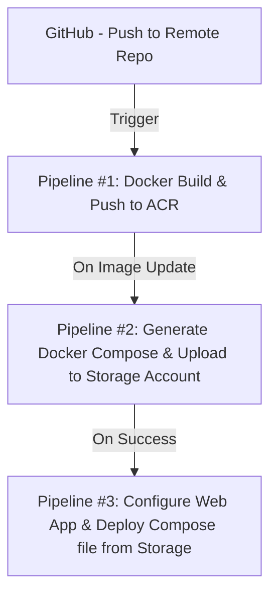

# CloudNinja Infra Recon

### CloudNinja Infra Recon is a playful, DevOps-focused application designed to scan and report on Azure cloud resources with a “ninja-themed” approach. It combines **Blazor** (UI), **ASP.NET Web API** (backend), **Azure Functions** (resource scanning), **Terraform** (IaC), and **Azure DevOps** (CI/CD pipelines) to demonstrate a full end-to-end cloud solution.

---

## Overview

**CloudNinja Infra Recon** offers two primary “missions” or scans:

1. **Shadow Sentinel** – Scans web apps for vulnerabilities.  
2. **Fortress Breach** – Checks for exposed public endpoints (IPs, ports, etc.).  

Users can trigger these scans from a Blazor frontend. The results are generated by Azure Functions, then displayed in the UI with a ninja-themed flair.

---

## Features

- **Interactive Ninja-Themed UI** – Blazor interface that shows scanning progress and detailed vulnerability or endpoint reports.  
- **Azure Functions Scanning** – Serverless functions that analyze Azure resources (App Services, IPs, etc.).  
- **Infrastructure as Code** – Terraform scripts provision all necessary Azure resources (Web App, Function App, Storage, etc.).  
- **Automated CI/CD** – Azure DevOps pipelines for building Docker images, uploading Docker Compose files, and deploying containers to Azure.  
- **Flexible & Modular** – Missions can be expanded to add more scanning logic (e.g., Key Vault checks, SQL security audits).

---
 

## FlowChart on CICD

Below is a simplified flowchart illustrating how code moves from GitHub through CI/CD pipelines, and how the application components integrate:


## Project Structure
```plaintext
cloud-ninja-infra-recon/
├── 📄 azure-pipelines/
│   ├── build-and-push.yml
│   ├── docker-compose-generate.yml
│   ├── deploy-compose.yml
│   └── functions-deploy.yml
│
├── 📁 src/
│   ├── 📁 backend/
│   │   ├── 📁 CloudNinjaAPI/
│   │   │   ├── Program.cs
│   │   │   └── CloudNinjaAPI.csproj
│   │   │  
│   │   └── 📁 CloudNinjaFunctions/
│   │       ├── FortressBreach/
│   │       └─ ShadowSentinel/
│   │    
│   └── 📁 frontend/
│       └── CloudNinjaBlazor/
│           └── CloudNinjaBlazor.sln
├── 📁 infrastructure/
│   ├── main.tf
│   ├── variables.tf
│   └── 📁 modules/
│       ├── 📁 service_plan/
│       │   ├── main.tf
│       │   ├── variables.tf
│       │   └── outputs.tf
│       │
│       ├── 📁 webapp/
│       │   ├── main.tf
│       │   ├── variables.tf
│       │   └── outputs.tf
│       │
│       ├── 📁 storage_account/
│       │   ├── main.tf
│       │   ├── variables.tf
│       │   └── outputs.tf
│       │
│       └── 📁 azure_functions_app/
│           ├── main.tf
│           ├── variables.tf
            └── outputs.tf
```

## Tech Stack

- **Frontend**: Blazor (C#)  
- **Backend**: ASP.NET Web API (C#)  
- **Serverless**: Azure Functions (.NET)  
- **Infrastructure**: Terraform (azurerm provider)  
- **Containerization**: Docker & Docker Compose  
- **CI/CD**: Azure DevOps pipelines  
- **Cloud**: Azure App Service, Azure Container Registry, Azure Storage, etc.

---

## How It Works

1. **Developer pushes code** to GitHub → triggers the **first pipeline** (Docker Build & Push).  
2. **Docker image** is pushed to ACR.  
3. **Second pipeline** detects updated images in ACR → creates/updates Docker Compose file → uploads to Storage Account.  
4. **Third pipeline** runs when the second pipeline succeeds → configures the Web App → downloads Docker Compose from Storage → deploys the containers.  
5. **Blazor UI** is live. Users can select a scan (Shadow Sentinel or Fortress Breach).  
6. **Web API** calls **Azure Functions**, which scan Azure resources → results are returned as JSON.  
7. **Blazor** displays these results in a ninja-themed dashboard.
                                  
